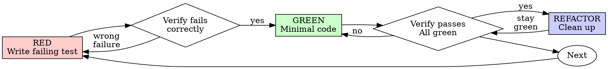

<required>
*CRITICAL* Add the following steps to your Todo list using TodoWrite:

1. Classify the task's test needs using the Decision Gate below → unit / integration / combination
2. Write failing test(s) for the chosen type (RED phase)
3. Verify the test fails due to the behavior of the application, and NOT due to the test.
<system-reminder>If you have more than one test that you need to write, you should write all of them before moving to the GREEN phase.</system-reminder>
4. Write the minimal amount of code necessary to make the test pass (GREEN phase)
5. Verify the test now passes due to the behavior of the application.
    - If you go through three loops without making progress, switch to running `~/.claude/skills/creating-debug-tests-and-iterating/SKILL.md`
6. Refactor the code to clean it up.
7. Verify tests still pass.
</required>

# Test Type Decision Gate

**Before writing any test, classify the task.**

```
What am I testing?
├── Pure function / utility / helper?          → Unit test
├── Single class with no side effects?         → Unit test
├── Service orchestrating other services?      → Integration test
├── API endpoint behavior?                     → Integration test
├── Database query / transaction?              → Integration test
├── External API interaction?                  → Integration test (mock external boundary only)
├── Message queue / event handling?            → Integration test
├── Middleware / interceptor chain?             → Integration test
├── Module wiring / DI resolution?             → Integration test
├── Would I need 3+ mocks to unit test this?   → Integration test
└── Mix of utility + boundary logic?           → Unit (utilities) + Integration (boundaries)
```

**The default is integration test.** Unit tests are the exception, reserved for pure logic with no dependencies. When in doubt, write an integration test.

## Why Integration Tests Are the Default

- Unit tests with heavy mocking test mock behavior, not real behavior
- Integration tests catch wiring bugs, serialization issues, and real interaction failures
- A passing integration test gives higher confidence than a passing unit test with 5 mocks
- "Only unit test utilities. Production code must be end-to-end tested."

---

# Red-Green-Refactor



---

# Unit Test TDD

Use when the Decision Gate says **unit test**.

## Test Writing Guidelines

- Always test real behavior.
- Do not write tests that are just mocks.
- Do not write tests that test implementation detail.
- Do not write tests that just test data structure format.
- Do not write tests that test types.

## RED - Write Failing Test

Write one minimal test showing what should happen.

<good-example>

```typescript
test('retries failed operations 3 times', async () => {
  let attempts = 0;
  const operation = () => {
    attempts++;
    if (attempts < 3) throw new Error('fail');
    return 'success';
  };

  const result = await foobar.retryOperation(operation);

  expect(result).toBe('success');
  expect(attempts).toBe(3);
});
```

Clear name, tests real behavior, one thing. Note that the tested operation is
imported -- this is a STRONG sign that this is testing something real.

</good-example>

<bad-example>

```typescript
test('retry works', async () => {
  const mock = jest
    .fn()
    .mockRejectedValueOnce(new Error())
    .mockRejectedValueOnce(new Error())
    .mockResolvedValueOnce('success');
  await retryOperation(mock);
  expect(mock).toHaveBeenCalledTimes(3);
});
```

Vague name, tests mock not code
</bad-example>

## GREEN - Minimal Code

Write simplest code to pass the test.

<good-example>
```typescript
async function retryOperation<T>(fn: () => Promise<T>): Promise<T> {
  for (let i = 0; i < 3; i++) {
    try {
      return await fn();
    } catch (e) {
      if (i === 2) throw e;
    }
  }
  throw new Error('unreachable');
}
```
Just enough to pass
</good-example>

<bad-example>
```typescript
async function retryOperation<T>(
  fn: () => Promise<T>,
  options?: {
    maxRetries?: number;
    backoff?: 'linear' | 'exponential';
    onRetry?: (attempt: number) => void;
  }
): Promise<T> {
  // YAGNI
}
```
Over-engineered
</bad-example>

Don't add features, refactor other code, or "improve" beyond the test.

---

# Integration Test TDD

Use when the Decision Gate says **integration test**.

The RED-GREEN-REFACTOR cycle is identical. What changes is **scope and setup**.

## Key Differences from Unit Tests

| Aspect | Unit Test | Integration Test |
|--------|-----------|------------------|
| Dependencies | All mocked | Real (mock only external boundaries) |
| Setup | Instantiate class directly | Bootstrap module/app context |
| Assertions | Return values, state | Observable system behavior (HTTP responses, DB state, events) |
| Speed | Milliseconds | Seconds (acceptable tradeoff) |
| What to mock | Everything except SUT | Only things you don't own (external APIs, third-party services) |

## RED - Write Failing Integration Test

<good-example>

**NestJS service integration:**

```typescript
describe('OrderManageService (integration)', () => {
  let module: TestingModule;
  let orderManageService: OrderManageService;
  let dataSource: DataSource;

  beforeAll(async () => {
    module = await Test.createTestingModule({
      imports: [AppModule], // Real module, real wiring
    }).compile();

    orderManageService = module.get(OrderManageService);
    dataSource = module.get(DataSource);
  });

  afterAll(() => module.close());

  test('creates order and updates inventory in single transaction', async () => {
    // Arrange: seed test data
    const product = await seedProduct(dataSource, {stock: 10});

    // Act
    const order = await orderManageService.createOrder({
      productId: product.id,
      quantity: 3,
    });

    // Assert: check real DB state
    const updatedProduct = await dataSource
      .getRepository(ProductModel)
      .findOneBy({id: product.id});

    expect(order.status).toBe(OrderStatus.CREATED);
    expect(updatedProduct.stock).toBe(7);
  });
});
```

Real module, real DB, real transaction. Mocks nothing internal.

</good-example>

<good-example>

**API endpoint integration:**

```typescript
describe('POST /orders (integration)', () => {
  let app: INestApplication;

  beforeAll(async () => {
    const module = await Test.createTestingModule({
      imports: [AppModule],
    }).compile();

    app = module.createNestApplication();
    await app.init();
  });

  afterAll(() => app.close());

  test('returns 201 and creates order', async () => {
    const response = await request(app.getHttpServer())
      .post('/orders')
      .send({productId: 'prod-1', quantity: 2})
      .expect(201);

    expect(response.body).toMatchObject({
      status: 'CREATED',
      productId: 'prod-1',
    });
  });

  test('returns 400 for insufficient stock', async () => {
    await request(app.getHttpServer())
      .post('/orders')
      .send({productId: 'prod-1', quantity: 9999})
      .expect(400);
  });
});
```

Tests real HTTP behavior, not mock responses.

</good-example>

<bad-example>

```typescript
// ❌ "Integration test" that mocks everything
test('creates order', async () => {
  const mockOrderRepo = {save: jest.fn().mockResolvedValue({id: '1'})};
  const mockProductRepo = {findOne: jest.fn().mockResolvedValue({stock: 10})};
  const mockTxManager = {runTransaction: jest.fn(cb => cb())};

  const service = new OrderManageService(
    mockOrderRepo as any,
    mockProductRepo as any,
    mockTxManager as any,
  );

  await service.createOrder({productId: 'p1', quantity: 3});
  expect(mockOrderRepo.save).toHaveBeenCalled();
});
```

This is a unit test pretending to be an integration test. Tests mock behavior.

</bad-example>

## GREEN - Minimal Code

Same as unit tests: write the simplest code to make the integration test pass.

## When to Mock in Integration Tests

**Mock only what you don't own:**

- External HTTP APIs (use interceptors or test doubles)
- Third-party services (payment gateways, email providers)
- System clock (when testing time-dependent behavior)

**Never mock in integration tests:**

- Your own services, repositories, or modules
- Database connections (use a test database)
- Internal message passing or events

---

# Verify Steps (Both Types)

## Verify RED - Watch It Fail

**MANDATORY. Never skip.**

```bash
npm test path/to/test.spec.ts
```

Confirm:

- Test fails (not errors)
- Failure message is expected
- Fails because feature missing (not typos)

**Test passes?** You're testing existing behavior. Fix test.

**Test errors?** Fix error, re-run until it fails correctly.

## Verify GREEN - Watch It Pass

**MANDATORY.**

```bash
npm test path/to/test.spec.ts
```

Confirm:

- Test passes
- Other tests still pass
- Output pristine (no errors, warnings)

**Test fails?** Fix code, not test.

**Other tests fail?** Fix now.

## REFACTOR - Clean Up

After green only:

- Remove duplication
- Improve names
- Extract helpers

Keep tests green. Do not add behavior.

---

# Common Failure Patterns -- DO NOT DO THESE THINGS

| Excuse                                 | Reality                                                                 |
| -------------------------------------- | ----------------------------------------------------------------------- |
| "Too simple to test"                   | Simple code breaks. Test takes 30 seconds.                              |
| "I'll test after"                      | Tests passing immediately prove nothing.                                |
| "Tests after achieve same goals"       | Tests-after = "what does this do?" Tests-first = "what should this do?" |
| "Already manually tested"              | Ad-hoc ≠ systematic. No record, can't re-run.                           |
| "Deleting X hours is wasteful"         | Sunk cost fallacy. Keeping unverified code is technical debt.           |
| "Keep as reference, write tests first" | You'll adapt it. That's testing after. Delete means delete.             |
| "Need to explore first"               | Fine. Throw away exploration, start with TDD.                           |
| "Test hard = design unclear"           | Listen to test. Hard to test = hard to use.                             |
| "TDD will slow me down"               | TDD faster than debugging. Pragmatic = test-first.                      |
| "Manual test faster"                   | Manual doesn't prove edge cases. You'll re-test every change.           |
| "Existing code has no tests"           | You're improving it. Add tests for existing code.                       |
| "Unit test needs too many mocks"       | **That's the signal to write an integration test instead.**             |

## RED FLAGS - STOP and Start Over

- Code before test
- Test after implementation
- Test passes immediately
- Can't explain why test failed
- Tests added "later"
- Rationalizing "just this once"
- "I already manually tested it"
- "Tests after achieve the same purpose"
- "It's about spirit not ritual"
- "Keep as reference" or "adapt existing code"
- "Already spent X hours, deleting is wasteful"
- "TDD is dogmatic, I'm being pragmatic"
- "This is different because..."
- **Mock setup is longer than test logic** (switch to integration test)
- **Mocking 3+ dependencies** (switch to integration test)

**All of these mean: Delete code. Start over with TDD.**
